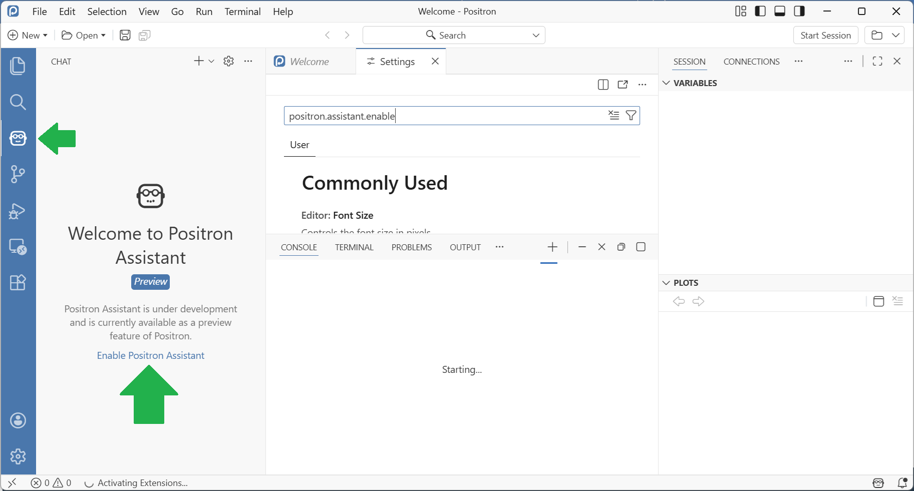

# Preparation

For the AI training, you actually only need to bring your work laptop and a charger.

During the training, we will use and sometimes compare several language models from academic and commercial providers. To prepare for the course, it would therefore be advantageous if participants already had accounts with some of these providers:
* [Helmholtz Blablador](https://helmholtz-blablador.fz-juelich.de/) (academic provider)
* [GWDG / Chat AI / Kisski of the Academic Cloud](https://chat-ai.academiccloud.de/) (academic provider)
* [OpenAI / ChatGPT](https://chatgpt.com/) (Commercial provider)
* [Anthropic / Claude](https://claude.ai/) (Commercial provider)
* [Google Gemini](https://gemini.google.com/) + [NotebookLM](https://notebooklm.google/) (Commercial provider)
* [You.com](https://you.com) (Commercial provider)
* [Perplexity](https://www.perplexity.ai/) (Commercial provider)
* [scite.ai](https://scite.ai) (Commercial provider)
* [julius.ai](https://julius.ai) (Commercial provider)

If you are unsure about which providers you want to create an account with and which ones you don't, you can gladly postpone this decision until the training.

## Data Analysis at Helmholtz Compute Center in Jülich (optional)

If you want to execute AI-generated Python code as part of an exercise, consider logging in to the compute center in Jülich via its [Jupyter Platform](https://jupyter.jsc.fz-juelich.de/).

From within a new Jupyter Notebook install [bia-bob](https://github.com/haesleinhuepf/bia-bob) like this:

```
!pip install bia-bob
```

The rest of the installation will be done during the course.

Note: When chatting with this system, your prompts are submitted to a commercial, remote service provider and you may not know what they do with your data. Be careful and do not enter private or secret research information.

## AI-integration in Positron (for R-users, optional)

If you want to execute AI-generated R Code as part of one exercise, install the [Positron App](https://positron.posit.co/) in a recent version and activate the AI assistant:



Note: When chatting with this system, your prompts are submitted to a commercial, remote service provider and you may not know what they do with your data. Be careful and do not enter private or secret research information.

## Install local language models (optional)

If you want to play with locally installed, privacy-preserving language-models, install [ollama](https://ollama.com/download) on your computer. After it is installed, download the language model [llama3.2](https://ollama.com/library/llama3.2:1b) by executing this command on the command line: 

```
ollama run llama3.2:1b
```

