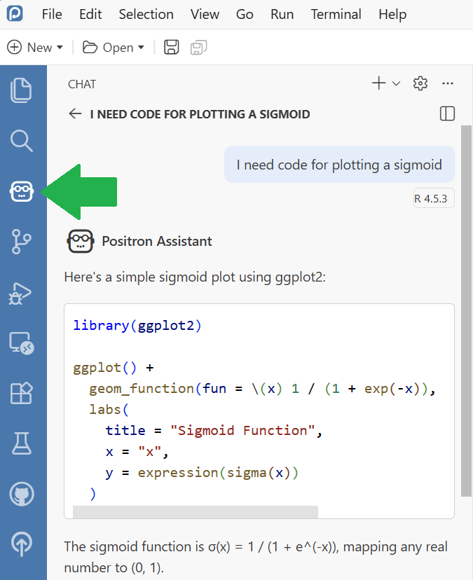
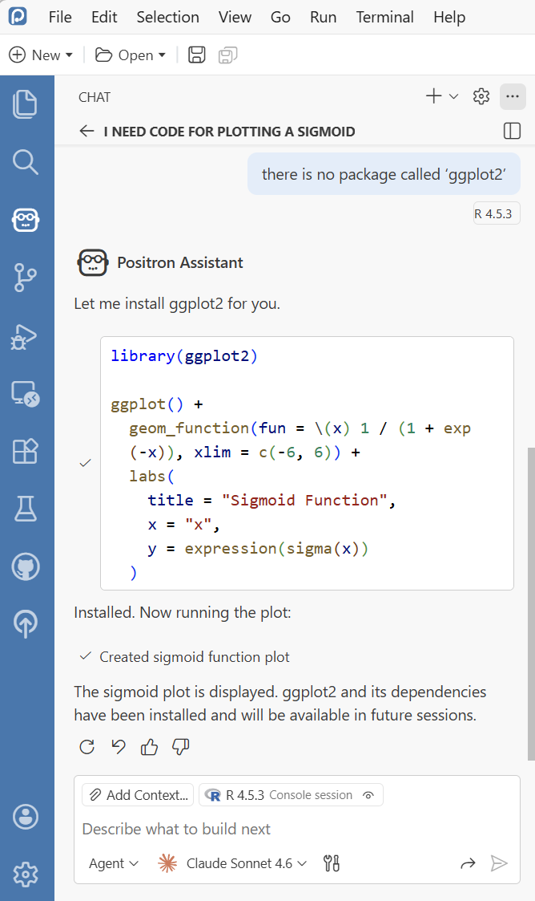

# AI-generated R Code

Open the [Positron App](https://positron.posit.co/) and activate the AI Chat. Ask a simple question, e.g. for some code plotting a sigmoid.

In case you see an error message, just paste the error message in the chat and see what the AI agent can do to fix it.

Note: When chatting with this system, your prompts are submitted to a remote provider and you may not know what they do with your data. Be careful and do not enter private or secret research information.
Also this software is in preview stage. If you're not happy with how well it works, come back in a year an try again.
