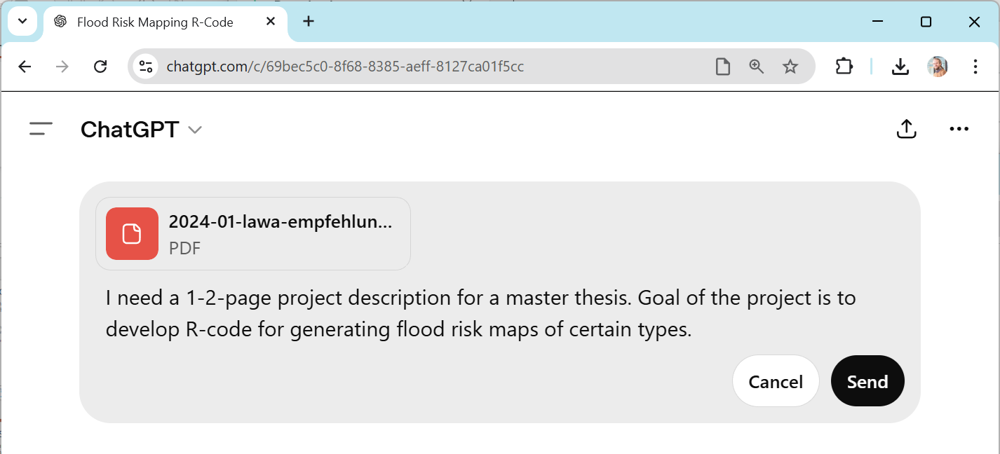

# Writing project proposals

In this exercise we take the [Recommendations for Flood Risk Maps (in German)](https://www.lawa.de/documents/2024-01-lawa-empfehlungen-aufstellung-hochwassergefahrenkarten-barrierefrei_1739980622.pdf) (licensed [CC-BY 4.0](https://creativecommons.org/licenses/by/4.0/deed.en) by LAWA Ausschuss Hochwasserschutz und Hydrologie and contributors) to develop a project proposal for a master thesis. Along the path, we will investigate which Python/R libraries might be useful for this kind of data visualization.

* Start by downloading the document linked above.
* Upload it to the Chat-App of your choice. Not all services support uploading long documents. You can use ChatGPT savely with this document, because the document is shared under a permissive license.

Start with a prompt such as 
```
I need a 1-2-page project description for a master thesis. 
Goal of the project is to develop R-code for 
generating flood risk maps of certain types.
```



Potential result:


If the response is very long, modify the prompt. 
* Guide the LLM about the structure of the text. Provide sub-headlines
* Guide the LLM for the target audience: What background should potential candidates have? Computer science or earth/environmental science?
* Ask the LLM to provide recommendations for potential Python/R libraries which could be used for programming the flood risk map visualization.
